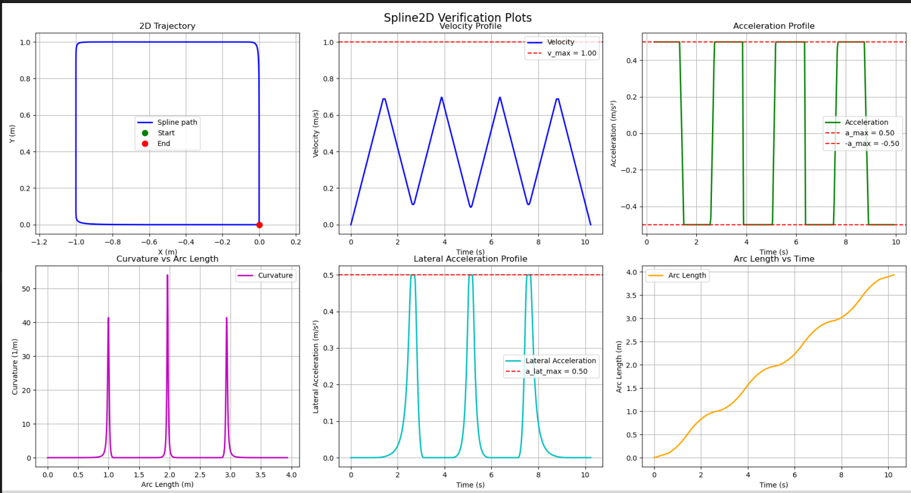

## overall structure:
- 3D trajectory
- 2D movement (x,y), and 1D heading (theta)
- Trapezoid for theta, Uniform BSpline for x,y
- You can tune curve sharpness using the repeatsForTurnAngle() function inside Spline2D, as well as changing the degree of the BSpline (higher degrees round more, but increase compute cost greatly)
- Quintic BSpline (current implementation) is continuous till 4th derivative, but jerk profile hasn't been added yet
- Spline2D makes a log file, using the logSplineData() function. This file can be read and plotted using plot_spline_data.py
 
- Just use the command: 

```python3 spline_verification.py spline_data.log --show-plots --save-report```